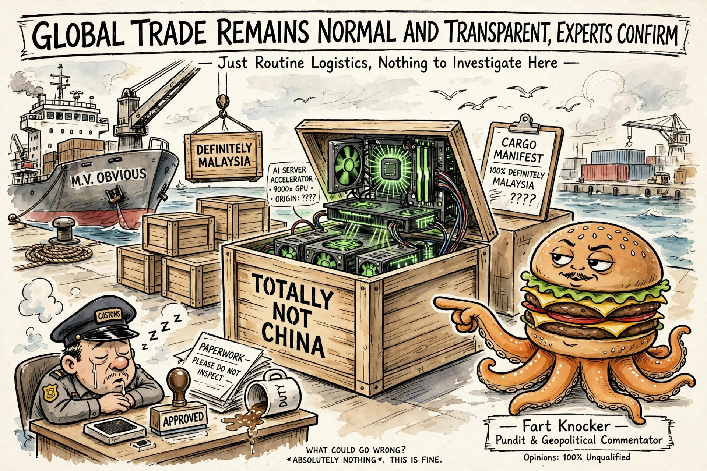

# Three Years, $300M, and a Fake Buyer Named Jackie Lui

- Sources: [Ars Technica](https://arstechnica.com/tech-policy/2026/10/us-arrests-tech-ceo-accused-of-smuggling-300m-in-nvidia-chips-into-china/) (Ashley Belanger, 2026-10-02)
- Verdict: keep
- Why: the export-control regime, examined. Three years of shipments, a fake buyer sharing the CEO's last name, and the shovel seller's official position that this is all a drop in the bucket.

*Fart Knocker, resident pundit, weighs in.*

## The L-takes

**The arrest.** Greg Lui, 38, CEO of Earthmade Computer, was arrested October 1 and indicted on three counts: conspiracy to violate the Export Control Reform Act, federal smuggling, and money laundering. He faces up to 20 years. The DOJ says he moved more than $300 million in servers carrying export-controlled Nvidia A100 and H100 GPUs into China between October 2023 and August 2026.

**The method.** Freight forwarders in Malaysia and Singapore, false paperwork, the classics. A 2024 order for 70 GPU servers was fraudulently claimed as Malaysia-bound; a co-conspirator later told a Malaysian government official all 27 servers from one purchase order (~$7.6M) actually went to China. Another 92 servers traveled Singapore → Malaysia → Hong Kong → a firm in Hangzhou. A hundred H100 servers worth over $22M were documented under a fake buyer whose CEO was identified as — and this is the detail that elevates the whole affair — "Jackie Lui." Same last name as the guy running the scheme. In 2024 alone, Lui's firm allegedly took in more than $176M from it, with the receipts sitting in Bank of America and JP Morgan accounts.

**The timeline.** Three years. Not three weeks, not a single intercepted shipment — a three-year logistics operation with bank records, during which the export-control regime functioned as a paperwork suggestion.

**Nvidia's position.** A spokesperson called the diversion "a drop in the bucket compared to the ocean of domestic compute China already has" — less than half of one percent of Nvidia products, they say. "When the law is clear, American companies honor US laws as they are, not as America's critics wish they were." Translation: the shovel seller's position is that someone else's shovels are the problem. (See also: [[log/2026-08-28-nvidia-pulling-back]] — Nvidia doesn't need equity when everyone's buying GPUs, and apparently doesn't need questions when the GPUs keep moving.)

**The rebrand.** Assistant Attorney General John A. Eisenberg, quoted in the DOJ release: "SI is the defining technology of the era." The administration has rebranded AI as "super intelligence." The defining technology of the era is being smuggled in mislabeled crates, and the cops caught one guy after three years.

**The L:** export controls are a velvet rope, not a wall. The regime caught the paperwork three years late, the chips are already training models in Hangzhou, and the manufacturer's official stance is that it's statistically insignificant. Everybody in this story got what they wanted except the people the law was written for.
