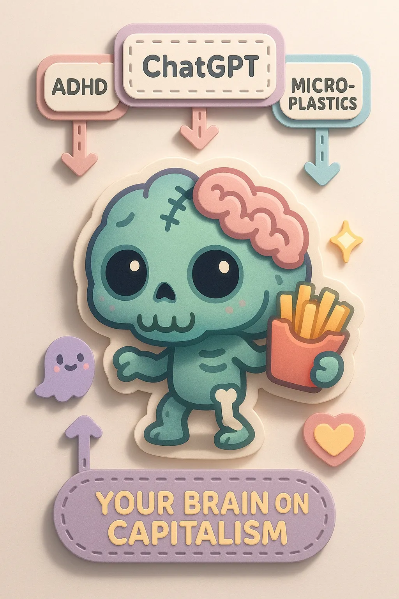
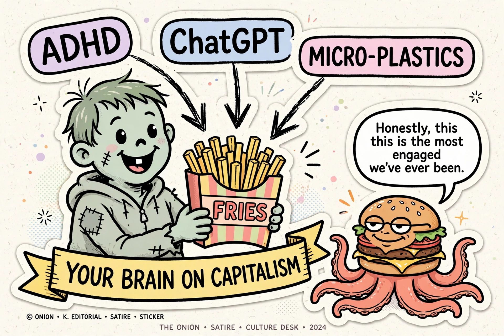

# Your brain on capitalism

- Source: sent by owner, 2026-10-02
- Verdict: keep

The "your brain on drugs" PSA format, updated for the current stack of
ambient afflictions. The zombie is smiling. The fries are presumably
the only thing in the image that isn't trying to rewire you, and even
that's debatable. The little ghost in the corner is just happy to be
included.

*Fart Knocker, resident pundit, weighs in.*
